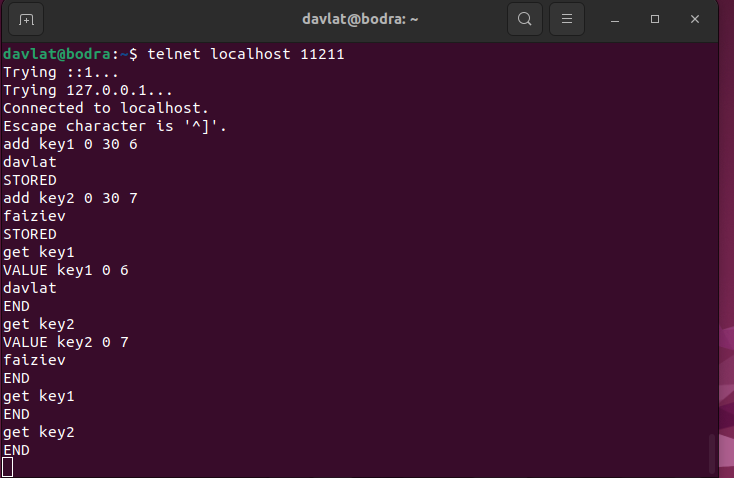

# Домашнее задание к занятию «Кеширование Redis/memcached» - Файзиев Давлат.

### Задание 1. Кеширование 

Приведите примеры проблем, которые может решить кеширование. 

*Приведите ответ в свободной форме.*

---
### Решение 1
Применение кеширования может решить следующие проблемы:
1. Улучшение производительности и скорости ответа;
2. Снижение нагрузки на серверы и базы данных;
3. Улучшение доступности и надежности;
4. Сглаживание бустов трафика;
5. Экономия ресурсов.

---
### Задание 2. Memcached

Установите и запустите memcached.

*Приведите скриншот systemctl status memcached, где будет видно, что memcached запущен.*

---
### Решение 2
Cкриншот systemctl status memcached:

---
### Задание 3. Удаление по TTL в Memcached

Запишите в memcached несколько ключей с любыми именами и значениями, для которых выставлен TTL 5. 

*Приведите скриншот, на котором видно, что спустя 5 секунд ключи удалились из базы.*

---
### Решение 3
Cкриншот удаления ключей, когда TTL истек:

---
### Задание 4. Запись данных в Redis

Запишите в Redis несколько ключей с любыми именами и значениями. 

*Через redis-cli достаньте все записанные ключи и значения из базы, приведите скриншот этой операции.*

---
### Решение 4
Cкриншот получения ключей и их значений из базы:

---
## Дополнительные задания (со звёздочкой*)
Эти задания дополнительные, то есть не обязательные к выполнению, и никак не повлияют на получение вами зачёта по этому домашнему заданию. Вы можете их выполнить, если хотите глубже разобраться в материале.

### Задание 5*. Работа с числами 

Запишите в Redis ключ key5 со значением типа "int" равным числу 5. Увеличьте его на 5, чтобы в итоге в значении лежало число 10.  

*Приведите скриншот, где будут проделаны все операции и будет видно, что значение key5 стало равно 10.*

---
### Решение 5
Cкриншот изменения значения ключа на заданный инкремент:

---
